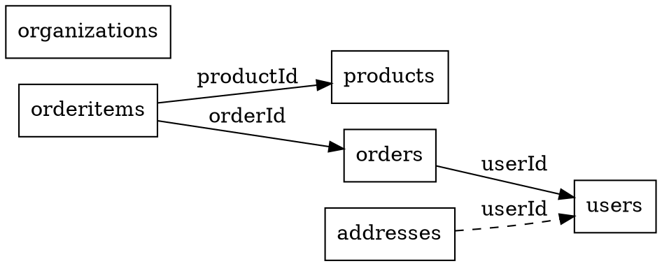
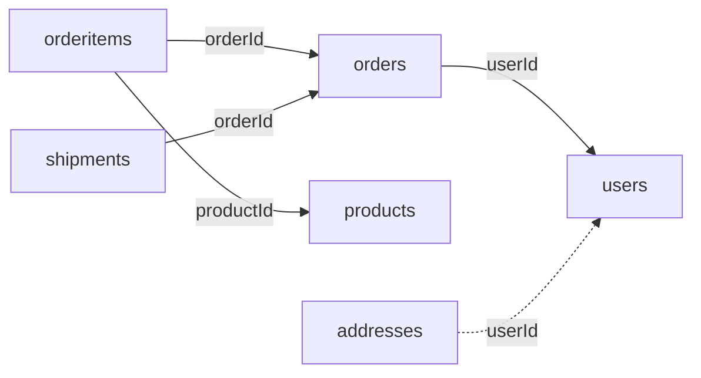

# Enterprise Guide: Chapter 2 - Dependency Management

## Why Dependency Management Matters

In a system with 50+ resources, understanding dependencies becomes impossible without tooling. Here's what typically happens:

**Developer**: "I need to change the `users` table schema."  
**Team Lead**: "What depends on users?"  
**Developer**: "Let me grep through the code... I found 37 files mentioning 'userId'..."  
**Team Lead**: "Did you check the indirect dependencies?"  
**Developer**: "The what?"

Two weeks later, production is down because `orderShipments` broke when `users` changed, even though it doesn't directly reference users. It gets user data through `orders` → `users`.

The Dependency Graph Plugin prevents these disasters by visualizing and analyzing your entire dependency tree.

## Understanding Dependencies

### Direct Dependencies
When one resource directly references another:

```javascript
// orders directly depends on users
api.addResource('orders', {
  schema: new Schema({
    userId: { type: 'id', refs: 'users' },     // Direct dependency
    productId: { type: 'id', refs: 'products' } // Direct dependency
  })
})
```

### Indirect Dependencies
When dependencies cascade through multiple levels:

```
shipments → orders → users
                  → products → categories
                            → brands
```

If you change `users`, you might break `shipments` even though they're not directly connected!

## Setting Up Dependency Management

### Step 1: Basic Setup

```javascript
import { Api, DependencyGraphPlugin } from 'json-rest-api'

const api = new Api()

api.use(DependencyGraphPlugin, {
  detectCircular: true,  // Throw error on circular dependencies
  maxDepth: 10,         // How deep to analyze
  exportFormat: 'dot',  // Default visualization format
  strict: true          // Throw errors vs warnings
})
```

### Step 2: Define Your Resources

Let's build a realistic e-commerce system:

```javascript
// Users and authentication
api.addResource('users', {
  schema: new Schema({
    email: { type: 'string', unique: true },
    organizationId: { type: 'id', refs: 'organizations' }
  })
})

api.addResource('organizations', {
  schema: new Schema({
    name: { type: 'string', required: true },
    parentId: { type: 'id', refs: 'organizations' }, // Self-reference!
    billingAccountId: { type: 'id', refs: 'billingaccounts' }
  })
})

// Products and inventory
api.addResource('products', {
  schema: new Schema({
    name: { type: 'string', required: true },
    categoryId: { type: 'id', refs: 'categories' },
    brandId: { type: 'id', refs: 'brands' },
    supplierId: { type: 'id', refs: 'suppliers' }
  })
})

api.addResource('inventory', {
  schema: new Schema({
    productId: { type: 'id', refs: 'products', required: true },
    warehouseId: { type: 'id', refs: 'warehouses', required: true },
    quantity: { type: 'number', default: 0 }
  })
})

// Orders and fulfillment
api.addResource('orders', {
  schema: new Schema({
    userId: { type: 'id', refs: 'users', required: true },
    shippingAddressId: { type: 'id', refs: 'addresses' },
    billingAddressId: { type: 'id', refs: 'addresses' }
  })
})

api.addResource('orderitems', {
  schema: new Schema({
    orderId: { type: 'id', refs: 'orders', required: true },
    productId: { type: 'id', refs: 'products', required: true },
    inventoryId: { type: 'id', refs: 'inventory' }
  })
})

api.addResource('shipments', {
  schema: new Schema({
    orderId: { type: 'id', refs: 'orders', required: true },
    warehouseId: { type: 'id', refs: 'warehouses' },
    carrierId: { type: 'id', refs: 'carriers' }
  })
})

// Supporting resources
api.addResource('addresses', {
  schema: new Schema({
    userId: { type: 'id', refs: 'users' },
    street: { type: 'string', required: true }
  })
})
```

### Step 3: Analyze Dependencies

```javascript
// Get the full dependency graph
const graph = api.dependencies.graph()
console.log(`System complexity:
- Resources: ${Object.keys(graph.nodes).length}
- Relationships: ${graph.edges.length}
- Average dependencies per resource: ${
  graph.edges.length / Object.keys(graph.nodes).length
}`)

// Check for circular dependencies
const circles = api.dependencies.circles()
if (circles.length > 0) {
  console.error('CIRCULAR DEPENDENCIES DETECTED!')
  circles.forEach(circle => {
    console.error(`  ${circle.join(' → ')}`)
  })
}
```

## Visualizing Dependencies

### Generate Graphviz Diagram

```javascript
// Export as DOT format for Graphviz
const dotGraph = api.dependencies.export('dot')
fs.writeFileSync('dependencies.dot', dotGraph)

// Generate PNG with Graphviz
// $ dot -Tpng dependencies.dot -o dependencies.png
```

This generates:


### Generate Mermaid Diagram

```javascript
// Export as Mermaid for documentation
const mermaidGraph = api.dependencies.export('mermaid')
console.log(mermaidGraph)
```

Output:


### Interactive Web Visualization

```javascript
// Create an interactive D3.js visualization
const jsonGraph = api.dependencies.export('json')

// Serve this with a web page
app.get('/api/dependencies', (req, res) => {
  res.json(jsonGraph)
})
```

```html
<!-- dependencies.html -->
<!DOCTYPE html>
<html>
<head>
  <script src="https://d3js.org/d3.v7.min.js"></script>
  <style>
    .node { fill: #69b3a2; }
    .node:hover { fill: #ff6b6b; }
    .link { stroke: #999; stroke-width: 2px; }
    .required { stroke: #333; stroke-width: 3px; }
    text { font: 12px sans-serif; }
  </style>
</head>
<body>
  <svg width="1200" height="800"></svg>
  <script>
    d3.json('/api/dependencies').then(data => {
      const svg = d3.select('svg')
      const width = +svg.attr('width')
      const height = +svg.attr('height')
      
      // Create force simulation
      const simulation = d3.forceSimulation(Object.values(data.nodes))
        .force('link', d3.forceLink(data.edges)
          .id(d => d.name)
          .distance(100))
        .force('charge', d3.forceManyBody().strength(-300))
        .force('center', d3.forceCenter(width / 2, height / 2))
      
      // Add links
      const link = svg.append('g')
        .selectAll('line')
        .data(data.edges)
        .join('line')
        .attr('class', d => d.required ? 'link required' : 'link')
      
      // Add nodes
      const node = svg.append('g')
        .selectAll('circle')
        .data(Object.values(data.nodes))
        .join('circle')
        .attr('r', d => 10 + d.dependencies.length * 2)
        .attr('class', 'node')
        .call(drag(simulation))
      
      // Add labels
      const label = svg.append('g')
        .selectAll('text')
        .data(Object.values(data.nodes))
        .join('text')
        .text(d => d.name)
        .attr('x', 12)
        .attr('y', 3)
      
      // Add hover info
      node.append('title')
        .text(d => `${d.name}
Dependencies: ${d.dependencies.length}
Dependents: ${d.dependents.length}`)
      
      simulation.on('tick', () => {
        link
          .attr('x1', d => d.source.x)
          .attr('y1', d => d.source.y)
          .attr('x2', d => d.target.x)
          .attr('y2', d => d.target.y)
        
        node
          .attr('cx', d => d.x)
          .attr('cy', d => d.y)
        
        label
          .attr('x', d => d.x)
          .attr('y', d => d.y)
      })
    })
    
    function drag(simulation) {
      function dragstarted(event) {
        if (!event.active) simulation.alphaTarget(0.3).restart()
        event.subject.fx = event.subject.x
        event.subject.fy = event.subject.y
      }
      
      function dragged(event) {
        event.subject.fx = event.x
        event.subject.fy = event.y
      }
      
      function dragended(event) {
        if (!event.active) simulation.alphaTarget(0)
        event.subject.fx = null
        event.subject.fy = null
      }
      
      return d3.drag()
        .on('start', dragstarted)
        .on('drag', dragged)
        .on('end', dragended)
    }
  </script>
</body>
</html>
```

## Impact Analysis

### What Breaks When I Change This?

```javascript
// Analyze impact of changing the users resource
const impact = api.dependencies.impact('users')

console.log('=== Impact Analysis for "users" ===')

console.log('\nDirect impacts (will definitely break):')
impact.direct.forEach(dep => {
  console.log(`  - ${dep.resource}.${dep.field}${dep.required ? ' (REQUIRED)' : ''}`)
})

console.log('\nIndirect impacts (might break):')
impact.indirect.forEach(dep => {
  console.log(`  - ${dep.resource} (via: ${dep.path.join(' → ')})`)
})

// Real output:
// === Impact Analysis for "users" ===
// 
// Direct impacts (will definitely break):
//   - orders.userId (REQUIRED)
//   - addresses.userId
//   - reviews.userId (REQUIRED)
//   - wishlists.userId (REQUIRED)
// 
// Indirect impacts (might break):
//   - orderitems (via: users → orders → orderitems)
//   - shipments (via: users → orders → shipments)
//   - payments (via: users → orders → payments)
//   - invoices (via: users → orders → invoices)
```

### Automated Impact Reports

```javascript
// Generate impact report for all resources
function generateImpactReport() {
  const report = {}
  const graph = api.dependencies.graph()
  
  for (const resource of Object.keys(graph.nodes)) {
    const impact = api.dependencies.impact(resource)
    
    report[resource] = {
      risk: calculateRisk(impact),
      directCount: impact.direct.length,
      indirectCount: impact.indirect.length,
      requiredDependents: impact.direct.filter(d => d.required).length,
      maxCascadeDepth: Math.max(...impact.indirect.map(d => d.depth), 0)
    }
  }
  
  // Sort by risk
  const sorted = Object.entries(report)
    .sort(([, a], [, b]) => b.risk - a.risk)
  
  console.log('=== Resource Risk Report ===')
  sorted.forEach(([resource, data]) => {
    console.log(`${resource}: Risk=${data.risk}/10`)
    console.log(`  Direct: ${data.directCount}, Indirect: ${data.indirectCount}`)
    console.log(`  Required by: ${data.requiredDependents} resources`)
    console.log(`  Max cascade: ${data.maxCascadeDepth} levels deep`)
    console.log()
  })
}

function calculateRisk(impact) {
  // Risk formula based on:
  // - Number of direct dependents (weight: 3)
  // - Number of required dependents (weight: 5) 
  // - Number of indirect dependents (weight: 1)
  // - Maximum cascade depth (weight: 2)
  
  const directScore = impact.direct.length * 3
  const requiredScore = impact.direct.filter(d => d.required).length * 5
  const indirectScore = impact.indirect.length * 1
  const depthScore = Math.max(...impact.indirect.map(d => d.depth), 0) * 2
  
  const totalScore = directScore + requiredScore + indirectScore + depthScore
  return Math.min(Math.round(totalScore / 10), 10) // Scale to 0-10
}
```

## Detecting and Fixing Circular Dependencies

### The Problem

Circular dependencies create maintenance nightmares:

```javascript
// DON'T DO THIS!
api.addResource('users', {
  schema: new Schema({
    organizationId: { type: 'id', refs: 'organizations' }
  })
})

api.addResource('organizations', {
  schema: new Schema({
    ownerId: { type: 'id', refs: 'users' } // Circular!
  })
})

// The plugin will detect this:
// Error: Circular dependencies detected: users → organizations → users
```

### Solutions

**Solution 1: One-way relationships**
```javascript
// Only organizations reference users, not vice versa
api.addResource('users', {
  schema: new Schema({
    email: { type: 'string' }
    // No organizationId here
  })
})

api.addResource('organizations', {
  schema: new Schema({
    ownerId: { type: 'id', refs: 'users' }
  })
})

// Get user's organization with a reverse query
const userOrgs = await api.resources.organizations.query({
  filter: { ownerId: userId }
})
```

**Solution 2: Junction table**
```javascript
// Break the cycle with a junction table
api.addResource('users', {
  schema: new Schema({
    email: { type: 'string' }
  })
})

api.addResource('organizations', {
  schema: new Schema({
    name: { type: 'string' }
  })
})

api.addResource('organizationmembers', {
  schema: new Schema({
    userId: { type: 'id', refs: 'users' },
    organizationId: { type: 'id', refs: 'organizations' },
    role: { type: 'string', enum: ['owner', 'member', 'admin'] }
  })
})
```

**Solution 3: Soft references**
```javascript
// Store ID without foreign key constraint
api.addResource('users', {
  schema: new Schema({
    email: { type: 'string' },
    organizationId: { type: 'string' } // Just store ID, no refs
  })
})

api.addResource('organizations', {
  schema: new Schema({
    name: { type: 'string' },
    ownerId: { type: 'id', refs: 'users' }
  })
})
```

## Schema Migration Planning

### Analyzing Migration Impact

When you need to change a schema, the plugin helps plan the migration:

```javascript
// Plan a schema change
const migration = api.dependencies.migration('products', {
  removedFields: ['oldCategoryId'],
  addedFields: ['categoryId', 'subcategoryId'],
  typeChanges: {
    price: { from: 'number', to: 'object' }, // Price becomes complex object
    status: { from: 'string', to: 'number' }  // Status enum to number
  }
})

console.log('=== Migration Plan for products ===')
console.log('Resources that need updating:')
migration.requiredUpdates.forEach(update => {
  console.log(`  ${update.resource}.${update.field}:`)
  console.log(`    Action: ${update.action}`)
  console.log(`    Reason: ${update.reason}`)
})
```

### Automated Migration Scripts

```javascript
// Generate migration script based on dependencies
function generateMigrationScript(resource, changes) {
  const impact = api.dependencies.impact(resource)
  const script = []
  
  script.push('-- Migration script for ' + resource)
  script.push('-- Generated: ' + new Date().toISOString())
  script.push('')
  
  // Phase 1: Add new columns
  if (changes.addedFields) {
    script.push('-- Phase 1: Add new columns')
    changes.addedFields.forEach(field => {
      script.push(`ALTER TABLE ${resource} ADD COLUMN ${field} VARCHAR(255);`)
    })
    script.push('')
  }
  
  // Phase 2: Update dependent resources
  if (impact.direct.length > 0) {
    script.push('-- Phase 2: Update dependent resources')
    impact.direct.forEach(dep => {
      if (dep.required) {
        script.push(`-- WARNING: ${dep.resource}.${dep.field} is REQUIRED`)
        script.push(`-- Ensure ${dep.resource} is updated to handle changes`)
      }
    })
    script.push('')
  }
  
  // Phase 3: Migrate data
  if (changes.typeChanges) {
    script.push('-- Phase 3: Migrate data')
    Object.entries(changes.typeChanges).forEach(([field, change]) => {
      script.push(`-- Convert ${field} from ${change.from} to ${change.to}`)
      if (change.from === 'number' && change.to === 'object') {
        script.push(`UPDATE ${resource} SET ${field}_new = JSON_OBJECT('value', ${field}, 'currency', 'USD');`)
      }
    })
    script.push('')
  }
  
  // Phase 4: Remove old columns
  if (changes.removedFields) {
    script.push('-- Phase 4: Remove old columns (after verification)')
    changes.removedFields.forEach(field => {
      script.push(`-- ALTER TABLE ${resource} DROP COLUMN ${field};`)
    })
  }
  
  return script.join('\n')
}

// Generate the script
const script = generateMigrationScript('products', {
  removedFields: ['oldPrice'],
  addedFields: ['priceAmount', 'priceCurrency'],
  typeChanges: {
    price: { from: 'number', to: 'object' }
  }
})

console.log(script)
```

## Real-World Example: Refactoring a Legacy System

Let's say you inherited a messy system with unclear dependencies:

```javascript
// Legacy system analysis tool
async function analyzeLegacySystem() {
  const graph = api.dependencies.graph()
  const analysis = {
    issues: [],
    recommendations: [],
    riskScore: 0
  }
  
  // Check 1: Circular dependencies
  const circles = api.dependencies.circles()
  if (circles.length > 0) {
    analysis.issues.push({
      type: 'circular-dependency',
      severity: 'critical',
      details: circles.map(c => c.join(' → '))
    })
    analysis.riskScore += circles.length * 10
  }
  
  // Check 2: God objects (too many dependents)
  const godObjectThreshold = 10
  for (const [name, node] of Object.entries(graph.nodes)) {
    if (node.dependents.length > godObjectThreshold) {
      analysis.issues.push({
        type: 'god-object',
        severity: 'high',
        resource: name,
        dependentCount: node.dependents.length
      })
      analysis.recommendations.push(
        `Consider splitting ${name} into smaller resources`
      )
      analysis.riskScore += 5
    }
  }
  
  // Check 3: Orphan resources (no relationships)
  for (const [name, node] of Object.entries(graph.nodes)) {
    if (node.dependencies.length === 0 && node.dependents.length === 0) {
      analysis.issues.push({
        type: 'orphan-resource',
        severity: 'low',
        resource: name
      })
      analysis.recommendations.push(
        `Review if ${name} is still needed`
      )
      analysis.riskScore += 1
    }
  }
  
  // Check 4: Deep dependency chains
  const maxAcceptableDepth = 5
  for (const resource of Object.keys(graph.nodes)) {
    const impact = api.dependencies.impact(resource)
    const maxDepth = Math.max(...impact.indirect.map(i => i.depth), 0)
    
    if (maxDepth > maxAcceptableDepth) {
      analysis.issues.push({
        type: 'deep-dependency-chain',
        severity: 'medium',
        resource: resource,
        depth: maxDepth
      })
      analysis.recommendations.push(
        `Refactor to reduce dependency depth for ${resource}`
      )
      analysis.riskScore += 3
    }
  }
  
  // Check 5: Missing inverse relationships
  for (const edge of graph.edges) {
    // Check if there's a reverse edge
    const reverseExists = graph.edges.some(e => 
      e.from === edge.to && e.to === edge.from
    )
    
    if (reverseExists) {
      analysis.issues.push({
        type: 'bidirectional-dependency',
        severity: 'medium',
        from: edge.from,
        to: edge.to
      })
      analysis.recommendations.push(
        `Consider making ${edge.from} ←→ ${edge.to} unidirectional`
      )
      analysis.riskScore += 2
    }
  }
  
  return analysis
}

// Run the analysis
const analysis = await analyzeLegacySystem()

console.log('=== Legacy System Analysis ===')
console.log(`Risk Score: ${analysis.riskScore}/100`)
console.log(`\nIssues Found: ${analysis.issues.length}`)

analysis.issues.forEach(issue => {
  console.log(`\n[${issue.severity.toUpperCase()}] ${issue.type}`)
  if (issue.resource) console.log(`  Resource: ${issue.resource}`)
  if (issue.details) console.log(`  Details: ${issue.details}`)
})

console.log('\nRecommendations:')
analysis.recommendations.forEach((rec, i) => {
  console.log(`${i + 1}. ${rec}`)
})
```

## Dependency Governance

### Setting Dependency Budgets

Limit complexity by setting "dependency budgets":

```javascript
// Configure maximum allowed dependencies
api.use(DependencyGraphPlugin, {
  budgets: {
    maxDependenciesPerResource: 5,
    maxDependentsPerResource: 10,
    maxCircularDependencies: 0,
    maxDependencyDepth: 4
  },
  
  onBudgetExceeded: (violation) => {
    console.error(`BUDGET EXCEEDED: ${violation.type}`)
    console.error(`  Resource: ${violation.resource}`)
    console.error(`  Current: ${violation.current}, Max: ${violation.max}`)
    
    if (process.env.NODE_ENV === 'production') {
      throw new Error(`Dependency budget exceeded: ${violation.type}`)
    }
  }
})
```

### Dependency Rules

Define rules about allowed dependencies:

```javascript
// Configure dependency rules
api.use(DependencyGraphPlugin, {
  rules: [
    {
      name: 'no-cross-domain-dependencies',
      test: (edge) => {
        const fromDomain = edge.from.split('_')[0]  // user_profiles → user
        const toDomain = edge.to.split('_')[0]      // order_items → order
        
        const allowedCrossDomain = [
          ['order', 'user'],
          ['order', 'product'],
          ['payment', 'order']
        ]
        
        if (fromDomain !== toDomain) {
          return allowedCrossDomain.some(([f, t]) => 
            fromDomain === f && toDomain === t
          )
        }
        return true
      },
      message: 'Cross-domain dependencies must be explicitly allowed'
    },
    
    {
      name: 'no-deep-dependencies',
      test: (edge, graph) => {
        // Prevent resources from depending on deeply nested resources
        const targetDepth = calculateResourceDepth(edge.to, graph)
        return targetDepth <= 2
      },
      message: 'Cannot depend on resources more than 2 levels deep'
    }
  ]
})
```

## Monitoring Dependencies Over Time

Track how your system complexity grows:

```javascript
// Dependency metrics collector
class DependencyMetrics {
  constructor(api) {
    this.api = api
    this.history = []
  }
  
  collect() {
    const graph = this.api.dependencies.graph()
    const metrics = {
      timestamp: new Date(),
      resources: Object.keys(graph.nodes).length,
      relationships: graph.edges.length,
      avgDependencies: graph.edges.length / Object.keys(graph.nodes).length,
      maxDependencies: Math.max(
        ...Object.values(graph.nodes).map(n => n.dependencies.length)
      ),
      maxDependents: Math.max(
        ...Object.values(graph.nodes).map(n => n.dependents.length)
      ),
      circularDependencies: this.api.dependencies.circles().length
    }
    
    this.history.push(metrics)
    return metrics
  }
  
  report() {
    const current = this.history[this.history.length - 1]
    const previous = this.history[this.history.length - 2]
    
    if (!previous) return console.log('First measurement recorded')
    
    console.log('=== Dependency Metrics Change ===')
    console.log(`Resources: ${previous.resources} → ${current.resources} (${
      current.resources > previous.resources ? '+' : ''
    }${current.resources - previous.resources})`)
    
    console.log(`Relationships: ${previous.relationships} → ${current.relationships} (${
      current.relationships > previous.relationships ? '+' : ''
    }${current.relationships - previous.relationships})`)
    
    console.log(`Avg Dependencies: ${previous.avgDependencies.toFixed(2)} → ${
      current.avgDependencies.toFixed(2)
    }`)
    
    if (current.circularDependencies > 0) {
      console.log(`⚠️  CIRCULAR DEPENDENCIES: ${current.circularDependencies}`)
    }
    
    // Calculate complexity score
    const complexityScore = 
      current.resources * 1 +
      current.relationships * 2 +
      current.maxDependents * 3 +
      current.circularDependencies * 10
    
    console.log(`\nComplexity Score: ${complexityScore}`)
    
    if (complexityScore > 500) {
      console.log('⚠️  System is becoming too complex. Consider refactoring.')
    }
  }
}

// Use in your build process
const metrics = new DependencyMetrics(api)
metrics.collect()
metrics.report()

// Save metrics to track over time
fs.writeFileSync(
  `metrics/dependencies-${Date.now()}.json`,
  JSON.stringify(metrics.history, null, 2)
)
```

## Integration with CI/CD

### GitHub Action for Dependency Checks

```yaml
# .github/workflows/dependency-check.yml
name: Dependency Analysis

on:
  pull_request:
    paths:
      - 'src/resources/**'
      - 'src/schemas/**'

jobs:
  analyze:
    runs-on: ubuntu-latest
    steps:
      - uses: actions/checkout@v3
      
      - name: Setup Node.js
        uses: actions/setup-node@v3
        with:
          node-version: '18'
      
      - name: Install dependencies
        run: npm ci
      
      - name: Run dependency analysis
        run: |
          node scripts/analyze-dependencies.js > dependency-report.txt
          
      - name: Comment PR
        uses: actions/github-script@v6
        with:
          script: |
            const fs = require('fs')
            const report = fs.readFileSync('dependency-report.txt', 'utf8')
            
            github.rest.issues.createComment({
              issue_number: context.issue.number,
              owner: context.repo.owner,
              repo: context.repo.repo,
              body: '## Dependency Analysis\n\n' + report
            })
      
      - name: Check dependency budgets
        run: |
          node scripts/check-dependency-budgets.js
          
      - name: Upload dependency graph
        uses: actions/upload-artifact@v3
        with:
          name: dependency-graph
          path: |
            dependencies.dot
            dependencies.png
```

### Dependency Check Script

```javascript
// scripts/analyze-dependencies.js
import { createApi } from '../src/api.js'

async function analyzePR() {
  const api = await createApi()
  
  // Check for circular dependencies
  const circles = api.dependencies.circles()
  if (circles.length > 0) {
    console.log('❌ CIRCULAR DEPENDENCIES DETECTED:')
    circles.forEach(circle => {
      console.log(`   ${circle.join(' → ')}`)
    })
    process.exit(1)
  }
  
  // Get changed resources (from git diff)
  const changedResources = getChangedResources() // Implementation depends on your setup
  
  console.log('### Dependency Impact Analysis\n')
  
  for (const resource of changedResources) {
    const impact = api.dependencies.impact(resource)
    
    console.log(`#### Changes to \`${resource}\` will affect:\n`)
    
    if (impact.direct.length > 0) {
      console.log('**Direct impacts:**')
      impact.direct.forEach(dep => {
        const severity = dep.required ? '🔴' : '🟡'
        console.log(`- ${severity} \`${dep.resource}.${dep.field}\``)
      })
      console.log()
    }
    
    if (impact.indirect.length > 0) {
      console.log('**Indirect impacts:**')
      impact.indirect
        .slice(0, 5) // Show first 5
        .forEach(dep => {
          console.log(`- \`${dep.resource}\` (via ${dep.path.join(' → ')})`)
        })
      
      if (impact.indirect.length > 5) {
        console.log(`- ... and ${impact.indirect.length - 5} more`)
      }
      console.log()
    }
  }
  
  // Generate visual diff
  console.log('### Dependency Graph\n')
  console.log('```mermaid')
  console.log(api.dependencies.export('mermaid'))
  console.log('```')
}

analyzePR().catch(console.error)
```

## Summary

Dependency management is crucial for maintaining large systems. Start by visualizing your current dependencies, then gradually add rules and budgets to prevent complexity from growing out of control. Remember:

1. **Visualize early and often** - Can't manage what you can't see
2. **Set budgets** - Limit complexity before it happens
3. **Automate checks** - Make dependency analysis part of CI/CD
4. **Plan migrations** - Use impact analysis before making changes
5. **Monitor trends** - Track complexity metrics over time

Next chapter: [Bounded Contexts →](./ENTERPRISE_GUIDE_03_Bounded_Contexts.md)